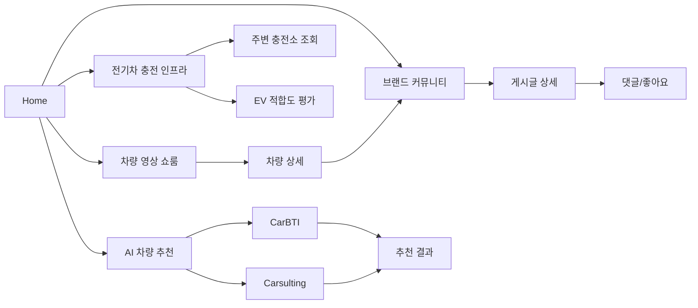
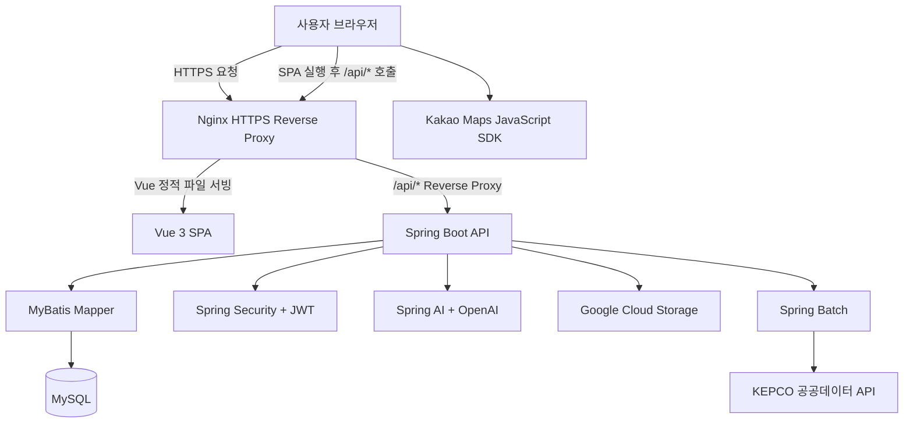
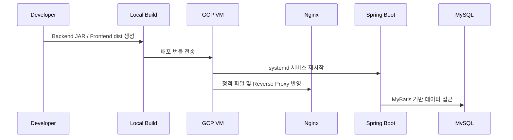

# ACCEL

<p align="center">
  
</p>

<p align="center">
  <strong>차량 탐색, 커뮤니티, 전기차 충전 인프라, AI 추천을 연결한 모빌리티 플랫폼</strong>
</p>

<p align="center">
  
  
  
  
  
  
</p>

## 프로젝트 개요

ACCEL은 차량 구매와 이용 과정에서 흩어져 있는 정보를 하나의 서비스 흐름으로 묶은 프로젝트입니다. 사용자는 차량 영상과 브랜드 커뮤니티를 탐색하고, 전기차 충전소 위치를 확인하며, AI 설문 기반으로 자신에게 맞는 차량 추천을 받을 수 있습니다.

| 항목 | 내용 |
| --- | --- |
| 프로젝트명 | ACCEL |
| 개발 기간 | 2026.05.22 ~ 2026.06.24 |
| 프로젝트 구성 | 2인 팀 프로젝트 |
| 서비스 분야 | 모빌리티, 차량 커뮤니티, AI 추천 |
| Backend | `accel-back` |
| Frontend | `accel-front` |
| Deployment | Google Cloud VM, Nginx, MySQL, HTTPS |

## 링크

| 구분 | 링크 |
| --- | --- |
| GitHub Repository | https://github.com/HybridJ/Accel |
| 프로젝트 시연 영상 | https://youtu.be/ffxcanjgsgA |
| ERD | https://www.erdcloud.com/d/sNEf9ZQPWXhrbwEdo |
| 기획 자료 | https://canva.link/j3e7wt1mtqwa4fr |
| 최초 실행 가이드 | [FIRST_RUN.md](FIRST_RUN.md) |
| 배포 가이드 | [DEPLOYMENT.md](DEPLOYMENT.md) |

## 주요 기능

| 도메인 | 기능 |
| --- | --- |
| 인증/회원 | 회원가입, 로그인, Access Token/Refresh Token 기반 세션 유지, 마이페이지, 프로필 이미지 관리 |
| 차량 영상 | 브랜드/차종별 영상 쇼룸, 차량 상세 페이지, 연관 차량 탐색, YouTube 영상/썸네일 연동 |
| 브랜드 커뮤니티 | 브랜드별 게시판, 게시글 작성/수정/삭제, 이미지 업로드, 댓글, 게시글/댓글 좋아요 |
| 사용자 활동 | 내가 쓴 글, 댓글 단 글, 좋아요한 글 조회 |
| 전기차 인프라 | Kakao Maps 기반 위치 검색, 사용자 위치 주변 전기차 충전소 조회, 충전기 상태 정보 표시 |
| AI 추천 | CarBTI 성향 기반 추천, Carsulting 조건 기반 추천, 전기차 생활 적합도 평가 |
| 배치 | KEPCO 전기차 충전소 공공데이터 수집, 충전소/충전기 상태 갱신 스케줄링 |

## 서비스 흐름



## 시스템 구성



## 기술 스택

### Backend

| 기술 | 사용 목적 |
| --- | --- |
| Java 17 | 백엔드 애플리케이션 개발 |
| Spring Boot 4.0.7 | REST API 서버 |
| Spring Web MVC | 컨트롤러 기반 API 구성 |
| Spring Security | 인증/인가, JWT 필터링, 비밀번호 암호화 |
| OAuth2 Resource Server | Bearer Token 기반 JWT 검증 |
| Spring Batch | 충전소/충전기 데이터 수집 및 상태 갱신 |
| Spring AI | OpenAI 모델 연동, AI 추천 응답 생성 |
| MyBatis | SQL Mapper 기반 데이터 접근 |
| MySQL | 서비스 데이터 저장 |
| Google Cloud Storage | 프로필/게시글 이미지 저장 |
| Springdoc OpenAPI | Swagger API 문서화 |

### Frontend

| 기술 | 사용 목적 |
| --- | --- |
| Vue 3 | SPA UI 구현 |
| Vite | 개발 서버 및 프론트엔드 빌드 |
| Vue Router | 페이지 라우팅 및 인증 가드 |
| Pinia | 인증, 게시판, 영상, EV, AI 상태 관리 |
| Axios | REST API 통신 |
| Kakao Maps SDK | 지도 표시, 위치/주소 검색, 충전소 마커 표시 |

### Infra / External

| 기술 | 사용 목적 |
| --- | --- |
| Google Cloud Compute Engine | 서비스 배포 VM |
| Nginx | 정적 파일 서빙, API Reverse Proxy, HTTPS |
| Let's Encrypt | HTTPS 인증서 |
| KEPCO 공공데이터 API | 전기차 충전소/충전기 데이터 수집 |
| YouTube Data API | 차량 영상 데이터 구성 |
| OpenAI API | AI 추천 및 전기차 적합도 평가 |

## 백엔드 API 구성

| 도메인 | 주요 엔드포인트 |
| --- | --- |
| 인증 | `POST /auth/signup`, `POST /auth/login`, `POST /auth/refresh`, `POST /auth/logout` |
| 사용자 | `GET /user/me`, `PUT /user/me`, `GET /user/me/myboards`, `GET /user/me/mycomments`, `GET /user/me/mylikes` |
| 차량 영상 | `GET /videos/categories`, `GET /videos/categories/{category}`, `GET /videos/search`, `GET /videos/{vehicleId}` |
| 게시판 | `GET /boards/brands`, `GET /boards/brands/{brandId}`, `POST /boards/article`, `PUT /boards/articles/{articleId}`, `DELETE /boards/articles/{articleId}` |
| 댓글/좋아요 | `GET /comments/{articleId}`, `POST /comments/{articleId}`, `POST /comments/{commentId}/likes`, `POST /boards/articles/{articleId}/likes` |
| EV | `GET /ev/nearest`, `POST /ev/batch/stations`, `POST /ev/batch/chargers/status` |
| AI | `POST /ai/carbti`, `POST /ai/carsulting`, `POST /ai/ev/score` |

Swagger UI는 백엔드 실행 후 아래 주소에서 확인할 수 있습니다.

```text
http://localhost:8080/swagger-ui/index.html
```

## 프로젝트 구조

```text
accel
├─ accel-back
│  ├─ pom.xml
│  ├─ mvnw, mvnw.cmd
│  └─ src
│     ├─ main
│     │  ├─ java/com/accel/api
│     │  │  ├─ ai          # AI 추천, EV 적합도 평가
│     │  │  ├─ auth        # 회원가입, 로그인, 토큰 재발급
│     │  │  ├─ board       # 게시글, 댓글, 좋아요
│     │  │  ├─ config      # Security, Swagger, CORS 설정
│     │  │  ├─ ev          # 충전소 조회, 배치 작업
│     │  │  ├─ security    # JWT 발급/검증, UserDetails
│     │  │  ├─ storage     # Google Cloud Storage 연동
│     │  │  ├─ user        # 마이페이지, 사용자 활동
│     │  │  └─ video       # 차량/영상 도메인
│     │  └─ resources
│     │     ├─ mapper      # MyBatis XML Mapper
│     │     ├─ accel_schema.sql
│     │     ├─ accel_data.sql
│     │     ├─ application.properties
│     │     └─ application-init.properties
│     └─ test
├─ accel-front
│  ├─ package.json
│  ├─ vite.config.js
│  └─ src
│     ├─ assets
│     ├─ components
│     ├─ constants
│     ├─ lib
│     ├─ router
│     ├─ stores
│     └─ views
│        ├─ ai
│        ├─ auth
│        ├─ boards
│        ├─ ev
│        ├─ user
│        └─ videos
├─ deploy
│  └─ accel_vm_deploy.sh
├─ FIRST_RUN.md
├─ DEPLOYMENT.md
└─ README.md
```

## 실행 가이드

자세한 최초 DB 구성, `.env` 작성, `init` 프로필 실행 순서는 [FIRST_RUN.md](FIRST_RUN.md)를 참고하세요.

### 사전 요구사항

| 구분 | 버전/내용 |
| --- | --- |
| Java | 17 |
| Node.js | `^20.19.0` 또는 `>=22.12.0` |
| npm | Node.js 호환 버전 |
| DB | MySQL 8.x |
| API Key | OpenAI, YouTube, KEPCO, Kakao Maps |

### 환경 변수 예시

`accel-back/.env`

```properties
JWT_SECRET=your-256-bit-secret-key
DATABASE_URL=jdbc:mysql://localhost:3306/acceldb?serverTimezone=Asia/Seoul
DATABASE_USERNAME=accel
DATABASE_PASSWORD=your-password

OPENAI_API_KEY=your-openai-api-key
OPENAI_CHAT_MODEL=gpt-5-mini
YOUTUBE_API_KEY=your-youtube-api-key
KEPCO_API_KEY=your-kepco-api-key
GCS_BUCKET_NAME=your-gcs-bucket-name
```

`accel-front/.env`

```properties
VITE_API_BASE_URL=http://localhost:8080
VITE_KAKAO_MAP_APP_KEY=your-kakao-javascript-key
```

### Backend

```powershell
cd accel-back
.\mvnw.cmd spring-boot:run
```

macOS/Linux 환경에서는 `./mvnw spring-boot:run`을 사용합니다.

### Frontend

```bash
cd accel-front
npm install
npm run dev
```

프론트엔드 개발 서버 기본 주소는 다음과 같습니다.

```text
http://localhost:5173
```

### Build

```powershell
cd accel-back
.\mvnw.cmd -DskipTests package
```

```bash
cd accel-front
npm run build
```

## 배포

배포 환경은 Google Cloud Compute Engine VM, Nginx, MySQL, Spring Boot JAR, Vue 정적 파일 배포 구조로 구성했습니다. 자세한 배포 절차와 검증 명령은 [DEPLOYMENT.md](DEPLOYMENT.md)를 참고하세요.



## 핵심 구현 포인트

- JWT Access Token과 Refresh Token을 분리해 인증 흐름을 구성했습니다.
- Vue Router 인증 가드와 Pinia 인증 Store를 연동해 보호 페이지 접근을 제어했습니다.
- 게시글/프로필 이미지는 Google Cloud Storage에 저장하고, 백엔드 API를 통해 접근하도록 구성했습니다.
- Spring Batch로 KEPCO 전기차 충전소 데이터를 초기 적재하고 충전기 상태를 주기적으로 갱신하도록 설계했습니다.
- Kakao Maps SDK를 활용해 위치 검색, 현재 위치 기반 충전소 조회, 마커 렌더링을 구현했습니다.
- Spring AI Tool Calling을 활용해 실제 서비스 DB의 브랜드/차량 후보를 기반으로 AI 추천 응답을 생성했습니다.

## 팀

Team ACCEL

SSAFY 15기 대전 5반 1팀
